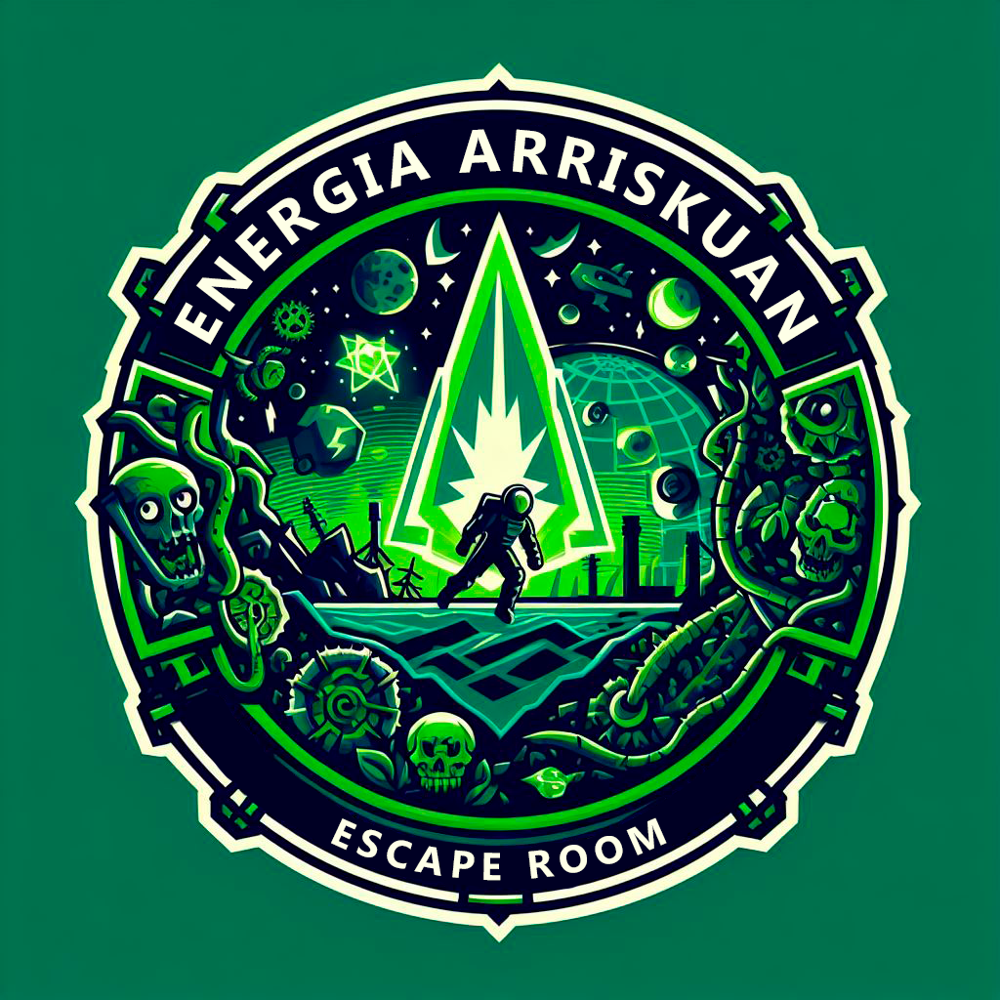

# :alien: Escape Room: Energia Arriskuan

Urteak dira 2073an, Lur planetak baliabide fosilak agortuta ditu, eta elektrizitatea sortzea zaila da. Zibilizazio estralurtarrek eraso egiten dute, energia berriztagarrietan dagoen ezagutza lapurtzeko helburuarekin. Txurdinaga LHII zentroa da azken erasoaren lekua, estalurtar taldeak energia berriztagarrian garatutako ezagutza lapurtu du eta zentroko sistema guztiak deskonektatu ditu.

<div align="center">




<div>

## 📑 Aurkibidea

1. [Deskribapena](#-deskribapena)
2. [Ezaugarriak](#-características)
3. [Hizkuntzak eta Teknologiak](#computer-hizkuntzak-eta-teknologiak)
4. [Workspace](#keyboard-workspace)
5. [Instalazioa](#-instalazioa)
6. [Erabilera](#-erabilera)
7. [Garatzaileak](#-garatzaileak)
8. [Kontaktua](#%EF%B8%8F-kontaktua)
9. [Eskerrik asko!](#-eskerrik-asko)
10. [Ikastetxea](#-ikastetxea)

## 📝 Deskribapena

2073an gaude, eta planetako baliabide fosilak ia agortuta daude; urteak dira zentral konbentzionaletatik elektrizitatea sortzea ezinezkoa dela, eta energia berriztagarriak dira elektrizitatea sortzeko ardatz nagusia.

Lur planetako bizitza etsaia da, eta etengabe jasaten dituzte zibilizazio estralurtarren erasoak, energia berriztagarrietan dugun ezagutza handia lapurtzen saiatzen baitira, beste planeta batzuetara eraman ahal izateko.

Txurdinaga LHII zentroa izan da Lurrean izandako azken erasoaren eszenatokia. Estralurtar talde batek zentroari eraso egin dio, urteetan energia berriztagarrian garatutako ezagutza guztia xurgatzeko helburuarekin, eta, horren ondorioz, zentroko sistema guztiak deskonektatu egin dira.

## 💎 Ezaugarriak

Hauek dira gure proiektuaren ezaugarri batzuk:

- `1. ezaugarria`: erabiltzaileek login egitea
- `2. ezaugarria`: jolas bat egitea denbora limite batekin

## :computer: Hizkuntzak eta Teknologiak
[]()
[]()
[]() 
[]()
[]()
[]()

## :keyboard: Workspace
[]()
[]()
[]()

## 🔧 Instalazioa  

Hauek dira gure proiektua desplegatzeko pausuak:

**1. pausua:** <br>
Xampp barruan dagoen "htdocs" karpetan:
```
git clone https://github.com/2324-EscapeRoom-2DW3/T1-2DW3D.git
```
**2. pausua:** <br>
Vs code ireki, eta *CTRL + Ñ* egin:
```
cd energiaArriskuan
```
**3. pausua:** <br>
Proiekturako gauzak deskargatu:
```
composer install
npm install
```
**4. pausua:** <br>
*.env* fitxategia sortu
```
cp .env.example .env
```
**5. pausua:** <br>
Email-en bidalketa funtzionatzeko *.env* fitxategia editatu behar da eta email jartzen duen tokian email bat eta pasahitza jarri beharko da:
```
APP_NAME=Energia_Arriskuan
APP_ENV=local
APP_KEY=base64:BxIqyfDYmOcXpO9ArD8Xt6yFdViWiUNv+7ZO/AcioQw=
APP_DEBUG=true
APP_URL=http://localhost

LOG_CHANNEL=stack
LOG_DEPRECATIONS_CHANNEL=null
LOG_LEVEL=debug

DB_CONNECTION=mysql
DB_HOST=127.0.0.1
DB_PORT=3306
DB_DATABASE=erronka2
DB_USERNAME=root
DB_PASSWORD=

BROADCAST_DRIVER=log
CACHE_DRIVER=file
FILESYSTEM_DISK=local
QUEUE_CONNECTION=sync
SESSION_DRIVER=file
SESSION_LIFETIME=120

MEMCACHED_HOST=127.0.0.1

REDIS_HOST=127.0.0.1
REDIS_PASSWORD=null
REDIS_PORT=6379

MAIL_MAILER=smtp
MAIL_HOST=smtp.gmail.com
MAIL_PORT=465
MAIL_USERNAME=(email@email.com)
MAIL_PASSWORD=(pasahitza)
MAIL_ENCRYPTION=ssl
MAIL_FROM_ADDRESS="(email@email.com)"
MAIL_FROM_NAME="${APP_NAME}"

AWS_ACCESS_KEY_ID=
AWS_SECRET_ACCESS_KEY=
AWS_DEFAULT_REGION=us-east-1
AWS_BUCKET=
AWS_USE_PATH_STYLE_ENDPOINT=false

PUSHER_APP_ID=
PUSHER_APP_KEY=
PUSHER_APP_SECRET=
PUSHER_HOST=
PUSHER_PORT=443
PUSHER_SCHEME=https
PUSHER_APP_CLUSTER=mt1

VITE_APP_NAME="${APP_NAME}"
VITE_PUSHER_APP_KEY="${PUSHER_APP_KEY}"
VITE_PUSHER_HOST="${PUSHER_HOST}"
VITE_PUSHER_PORT="${PUSHER_PORT}"
VITE_PUSHER_SCHEME="${PUSHER_SCHEME}"
VITE_PUSHER_APP_CLUSTER="${PUSHER_APP_CLUSTER}"
```
**6. pausua:** <br>
ADI: xampp a executatzen egon behar da, bai *Apache*, bai *MySQL*:
```
php artisan migrate
```
**7. pausua:** <br>
Proiektua exekutatzeko
```
npm run dev
```

## 📕 Erabilera

Gure proiektua Energia berristagarrien modulurako sortutako ikasleentzat egindako "escape room" bat da. Energia Arriskuan modulu hau dibertigarriago ikasteko egin da.

## 👨🏽‍💻 Garatzaileak

- **Aritz Garcia:** [@Aritz-Garcia](https://github.com/Aritz-Garcia)
- **Irkus Anzola:** [@IrkusAnzola](https://github.com/IrkusAnzola)
- **Adrian Ocampo:** [@AdriTxurdi](https://github.com/AdriTxurdi)

## ✉️ Kontaktua

- Email: [energiaarriskuan@gmail.com](mailto:energiaarriskuan@gmail.com)
- Twitter: [@EArriskuan](https://twitter.com/EArriskuan)
- Facebook: [Energia Arriskuan](https://www.facebook.com/profile.php?id=61555611103945&locale=es_ES)

## 🎁 Eskerrik asko!

* Beste batzuei proiektu honi buruz hitz egiten die 📢
* Garagardo bat gonbidatu 🍺 edo kafe bat ☕ taldeko norbaiti.
* Eskerrak eman publikoki 🤓.


## 🏫 Ikastetxea
[](https://fptxurdinaga.eus/)
Este proyecto ha sido desarrollado en el ciclo de Desarrollo de Aplicaciones Web del CIFP Txurdinaga LHII (Bilbao, Euskadi, Spain).
[https://fptxurdinaga.eus](https://fptxurdinaga.eus)
